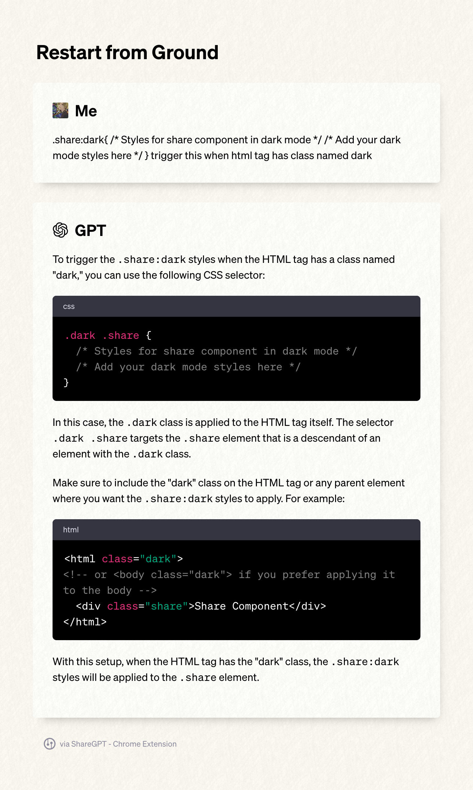
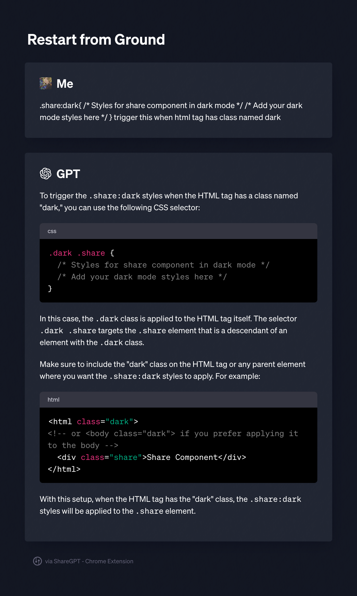

#   Share-GPT Chrome Extension

Share-GPT is a Chrome extension that allows users to easily generate images from ChatGPT dialogs and share them with others.

## Examples

## Development - Todo

- [x] Write and Correct README and set up the Git repository description
- [ ] Convert `px` to `rem` for better responsiveness
- [x] Enhance styles for better mobile readability
- [x] Add light mode support
- [x] (Done by OpenAI!)Sharing as a link to a page with the original content
- [ ] Avoid using arbitrary class names to locate contents

## What it does

- Collapse dialog blocks
- Add a floating button to specific web pages
- Generate checkboxes next to ChatGPT dialogs
- Select the desired dialogs and create images from them
- Stylish and modern-looking result!

## Installation on Chrome Web Store!

https://chrome.google.com/webstore/detail/sharegpt/kpefpnfbhbealfoihgbcieggmbmmlaej

## Usage

1. Navigate to a web page with ChatGPT dialogs (e.g., \`https://chat.openai.com/chat\`).

2. Click the floating button in the bottom-right corner of the page to show checkboxes next to the dialogs.

3. Select the dialogs you want to generate images from by checking the checkboxes.

4. Click the "Save" button that appears after selecting at least one dialog.

5. The extension will generate images from the selected dialogs and prompt you to save them.

## Contributing

Please feel free to create issues or submit pull requests if you have any suggestions, improvements, or bug fixes.

## License

This project is licensed under the [MIT License](LICENSE).

---

This project was bootstrapped with [Chrome Extension CLI](https://github.com/dutiyesh/chrome-extension-cli)

